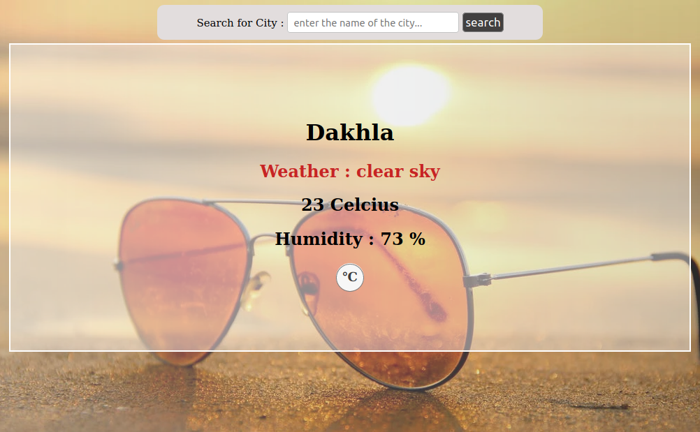
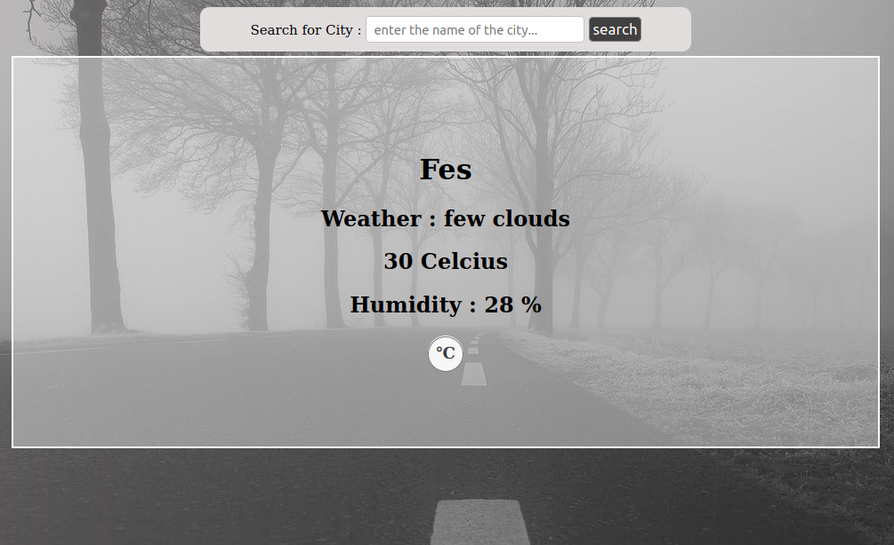

# WeatherApp

# WeatherApp (JavaScript)

This project is a weather app that allow user to search for weather by the name of the city.

## Live Demo

[Link here](https://wonderful-pare-04b09a.netlify.app/)

## ScreenShoot




## Built With

- JavaScript
- ESLint
- VS Code

## Prerequisites

You must have a browser on your PC in order to use the application. [Click here](https://www.mozilla.org/en-US/firefox/new/) to download one.

## Getting Started

1. clone the project

```bash
# Clone this repository
$ git clone https://github.com/rida-elbahtouri/WeatherApp.git

# Go into the repository
$ cd WeatherApp

# start the app
Copy the absolute path of the index file, paste on your browser and click on enter
```

## for webpack run:

the dependencies needed in this project are:

- webpack
- webpack-cli
- webpack-dev-server

**You can Install the dependencies with this commands**

```bash
$ npm run build

$ npm run start
```

## Usage

- open index.html in dist folder
- write the name of the city
- click on search to see the weather

## Authors

👤 **Rida Elbahtouri**

- [Github](https://github.com/rida-elbahtouri)
- [Twitter](https://twitter.com/RElbahtouri)
- [Linkedin](https://www.linkedin.com/in/rida-elbahtouri/)

## 🤝 Contributing

Contributions, issues and feature requests are welcome!

Feel free to check the <a href="https://github.com/rida-elbahtouri/WeatherApp/issues" target="_blank">issues page</a>.

## Show your support

Give a ⭐️ if you like this project!

## Acknowledgments

- <a href="https://www.theodinproject.com/" target="_blank">The Odin Project</a>
